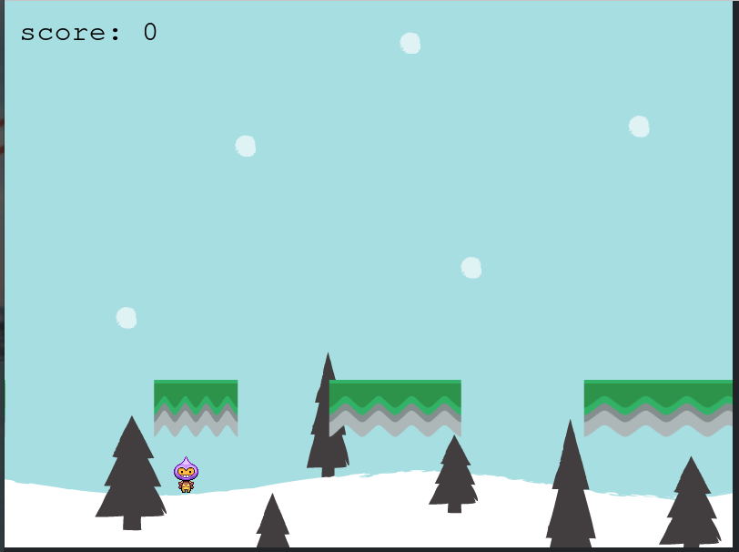
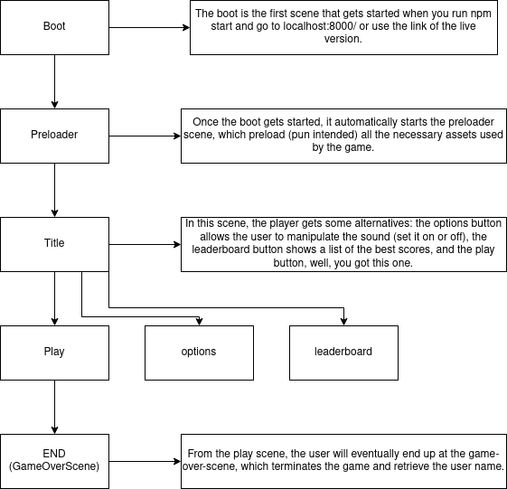

# Platform_Game

This game consists of one player running and jumping around, gathering stars and other elements while avoiding baddies. There's no point limit to the game. The player can increase his score indefinitely by never get hit by baddies. The challenging part is that after collecting all the stars in the scene, the number of baddies increments.

## Game Design

## Live Version

[Endless Game Live](https://widzthedvloper.github.io/Platform_Game/)

## Built With

- HTML
- CSS
- JAVASCRIPT
- WEBPACK
- BOOTSTRAP
- Phaser 3

## Getting Started

- Open the terminal command line.
- Clone the repo:--> git clone URL/ssh
- `cd Platform_Game` to make sure you are at the root of the game.
- `npm install` to install all the dependencies
- `npm start` to start the server
- preferably in a modern browser go to localhost:8000/ and start playing.

## Instructions

- Use your mouse left key to jump. Click twice to double jump. It only works once after you leave the ground.
- Make sure your mouse is in the surface area of the game or else when you click the player will not jump.
- you can you the left and right arrow keys, but there's not much you can do with them. Try them!
- Each time you collect a tomato, you'll get yourself an additional 10 points.
- the game ends when you fall from the ground.
- You'll be prompt to enter your name. You can hit the leaderboard button to see people better than yourself :)
- Enjoy!!!

## Test

- Non-functions were tested using Jest
-use the command `npm run test` in your terminal to see the tests

## Authors

👤 **Widzmarc Jean Nesly Phelle**

- GitHub: [@widzthedvloper](https://github.com/widzthedvloper)
- Twitter: [@widzthedvloper](https://twitter.com/widzthedvloper)
- LinkedIn: [@widzthedvloper](https://www.linkedin.com/in/widzmarc-jean-nesly-phelle-252a26129/)

## 🤝 Contributing

Contributions, issues, and feature requests are welcome!

## Show your support

Give a ⭐️ if you like this project!

## Acknowledgement

- JAVASRIPT Project by Microverse.

## 📝 License

This project is [MIT](/LICENSE) licensed.
