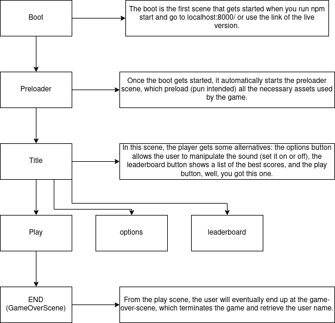

# Game Design

This game consists of one player running and jumping around, gathering tomatoes and other elements while avoiding falling.

## Main Objective

Your primary goal for this game is to collect as many tomatoes as possible without falling off the ground. There's only one scene for this game. Although, it might appear multiple to some of you.

### Description Of The Scene

The Game start with the player at the left corner standing on a platform. Don't get too comfortable. The scene is moving!
You can jump from one platform to the other. To do that, make sure your mouse is on the surface of the game, not the black part of your screen.
We know there will come a moment where you need an extra boost. When that moment came, make sure you left-click again. But it would work only once since you jump out of a platform.
Until you fall off the ground, there will be tomatoes flying over your head. Try to collect as much as you can to increase your score.

### Game Over Scene

Eventually, you will fall off the ground. When that happened, it's game over.
 We show your score and a reminder that you lose ;). And ask you to enter your name.
From that point on, you can view the highest scores or replay.

